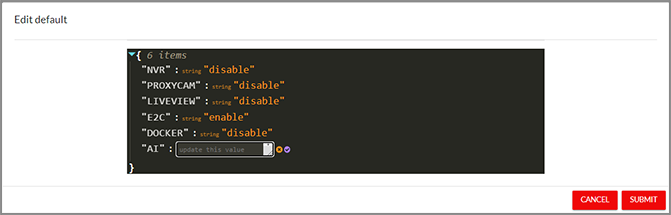

# Table of Contents
<!-- MarkdownTOC -->

- [Preface](#preface)
    - [Related documents](#related-documents)
    - [Document history](#document-history)
- [EdgeWay Management Overview](#edgeway-management-overview)
    - [Log in Screen](#log-in-screen)
    - [Main Screen and Dashboard](#main-screen-and-dashboard)
        - [Main Screen](#main-screen)
        - [Dashboard](#dashboard)
    - [Devices](#devices)
        - [Groups](#groups)
        - [Filters and search](#filters-and-search)
        - [Information](#information)
    - [Releases](#releases)
    - [Deployments](#deployments)
    - [Configurations](#configurations)
        - [Flavors](#flavors)
        - [Configs](#configs)
    - [Preferences](#preferences)
    - [About](#about)
    - [Settings](#settings)
        - [My Account](#my-account)
        - [Global Settings](#global-settings)
        - [My Organization Settings](#my-organization-settings)
        - [User Management](#user-management)
- [Working Scenarios](#working-scenarios)
    - [Connecting the Devices](#connecting-the-devices)
    - [Overviewing the IoT Infrastructure](#overviewing-the-iot-infrastructure)
    - [Deploying the Firmware](#deploying-the-firmware)
    - [Configuring the Devices](#configuring-the-devices)
    - [Managing Organization Profile, Users, and Access](#managing-organization-profile-users-and-access)
- [Glossary](#glossary)

<!-- /MarkdownTOC -->

# Preface
This document is intended for the users of **EdgeWay Management** and describes the procedures, work scenarios, and troubleshooting options managing the IoT infrastructure of the company.

##Related documents
| # | Title | Description | Version & Date |
|:--|:------|:------------|:---------------|
| 1 | [EdgeWay Platform Overview](/ewplatform.html) | | |
| 2 | [EW100 Installation Guide](/ew100ig.html) | | |
| 3 | [EdgeWay Connect](/ewconnect.html) | | |
| 4 | ... | | |

##Document history
| Ver | Description of change | Author(s) | Date       |
|:----|:----------------------|:----------|------------|
| 0.1 | Initial Version       | Maxim Galimov | 18.01.2021 |

# EdgeWay Management Overview
**EdgeWay Management** is a web application that helps configure the IoT infrastructure of the company including [EdgeWay devices](#device), [physical](#pcam) and [virtual](#vcam) cameras. **EdgeWay Management** is a part of the **EdgeWay Platform**.

**EdgeWay Management** helps users perform the following groups of procedures:

  - onboard, manage, organize and unplug [EdgeWay Node](#ewnode) devices,
  - review associated [physical cameras](#pcam),
  - get an overview of the devices and cameras working status,
  - review notifications from devices and cameras,
  - work with organization profile, manage users of **EdgeWay Management**, adjust their access rights.

**EdgeWay Management** offers a convenient way to perform operations depending on a role performed by a user:

  - **Administrator**, to work with EdgeWay devices and cameras, to manage users and their access to the application, 
  - **Viewer**, to overview the IoT structure without the access to change it.

## Log in Screen
Before a user can start working with **EdgeWay Management**, they must authorize (see [fig. 1](#fig1)). Initially, a tenant administrator receives their credentials during the [tenant](#tenant) [signing up procedure](#signing-up). Afterward, a tenant administrator may create more users and assign access rights to them (See [Managing Users and Access](#managing-users-and-access)).

Authorization credentials include login name and password. Also, a user may select a signing in option via the AUTH0 mechanism, for example, using their Google account. 

If a user is new to **EdgeWay Management**, they may sign up by clicking the _Sign up here_ link below the login form, or continue logging in with the existing AUTH0-account: the application will understand that the user needs to be registered. During the signing up procedure, a user will be requested to enter the first [device](#ewnode) [UUID](#UUID) to control it via the user's account. This UUID is provided with the device (the sticker on the bottom of the device).

A user may select the option _Stay logged in_ that lets **EdgeWay Management** remember the credentials for 30 days and simplify further access to the application.

_Figure 1. EdgeWay Manegement Log in screen_

_a) Login Screen_  

_b) Signing in via AUTH0_  

_c) Signing up_  

## Main Screen and Dashboard

### Main Screen
After authorization, a user comes to the main screen of the application that includes the top panel, left menu panel, and central part.

In the top panel, among the logo and application title, a user can see links to _Documentation_ and _SIEM Dashboard_ along with the basic information about devices: number of active devices available to overview and manage. 

An icon  (_Refresh_) leads to the [Deployments](#deployments) section where the tenant administrator may apply a firmware artifact to the devices.

_SIEM Dashboard_ link leads to the [SIEM](#SIEM) system's dashboard where the user may see the logged messages from the **EdgeWay Platform**.

A user role and login name information are visible in the right part of the top panel. The _User menu_ gives access to the [settings](#settings) of the account and organization and the user management.

_Figure 2. EdgeWay Management main screen_

On the left, in the menu panel, a user can see every action group available in the application (see chapters [below](#devices)).

### Dashboard
The Dashboard displays basic indicators of the [IoT infrastructure](#iot):

- **Active alarms**, a pie diagram showing how many alarms for devices are raised at the moment, see more in the chapter [Device Alarms&Actions Group](#device-alarmsactions-group).
- **Heartbeat summary**, a pie diagram showing the ping status of plugged devices: active or seen recently, not seen over 1 day, etc. 
- **Artifacts summary**, a pie diagram showing the device firmware version distribution. 

In the _Camera Statistics_ section, a user can see the distribution of cameras over the vendors and models.

In the _Devices_ section, there are simple statistics of the plugged devices (controlled via the **EdgeWay Management** interface).

In the _Deployments_ section, a user can see the firmware deployments by status: pending and in progress.

## Devices
The Devices section allows users to see the full list of EdgeWay devices, filter it by status and UUID, sort by characteristics, and organize plugged devices in groups ([see fig.3](#fig3)).

_Figure 3. EdgeWay Management Devices screen_

###Groups
All devices may be organized in groups. Initially, there are no groups, and just two predefined pseudo-groups are available: _All devices_ group lets a user see the full list of devices, _Ungrouped_ helps find devices not belonging to any group.

Groups may be created by clicking _Create a group_ link. Each group must contain at least one device, each device may belong to not more than one group ([see fig.4](#fig4)). If a user associates a device with some group, it will be removed from the other group.

_Figure 4. New group dialog_

By clicking the group name in the left panel, a user can switch to the list of devices belonging to the group. All manually created groups may be removed by entering the group and clicking the _REMOVE GROUP_ link ([see fig.5](#fig5)). After group deletion, all devices from the group become ungrouped.

_Figure 5. Group contents_

A device (or devices) may be added to a group by selecting them in the list of devices and clicking the button _MOVE SELECTED DEVICE TO ANOTHER GROUP_ in the bottom right corner of the screen ([see fig. 6](#fig6))

_Figure 6. Adding device or devices to a group_

###Filters and search
**EdgeWay Management** allows filtering devices in the list by UUID, a unique device identifier. For that, being in _All devices_, a user may click the _FILTERS_ button in the up-right corner and select UUID from the drop-down list and enter the UUID of the device in the field ([see fig.7](#fig7)).

_Figure 7. Filter panel_

Also, by clicking tabs in the upper part of the screen, a user may filter (search) devices by the authorization status:

- _Pending_ is a list of devices pending authorization
- _Preauthorized_ is a list of devices that will be authorized immediately after they are turned on
- _Rejected_ is a list of devices that are not anymore allowed to be managed

Two last tabs give additional opportunities to a user:

- _History_ displays a list of devices and allows to see the status change history of each (see [fig. 8](#fig8))
- _New Device_ allows adding a device by its UUID to the list of managed devices.  

_Figure 8. Device History_

###Information
Every device has multiple properties and data points that are displayed in the **EdgeWay Management** application. In the list, a user can see:

- _UUID_, a unique EdgeWay node identifier (set on the factory),
- _Device Type_, a model of the device,
- _Device Mode_, a field containing the information about the device configuration,
- _Comment_, a comment to the current configuration of the device,
- _Current Software_, a firmware installed on the device,
- _Last Heartbeat_, the date and time of last device activity received by **EdgeWay Management**.

By clicking the device line in the table, a user can open a device information panel. It contains the full information about the device and allows to change some options and device parameters ([see fig. 9](#fig9)).

_Figure 9. Device information_

There are the following fields in the device information panel:

####Device Identity group

Contains basic identification and status information about a device.

  - Fields
    + _Device ID_, an internal **EdgeWay Management** device identifier,
    + _UUID_, a unique EdgeWay node identifier,
    + _SIEM_, a link to the [SIEM](#siem) page of the device,
    + _First request_, the date and time of the first request to the device, displays the starting point of device monitoring by the **EdgeWay Management** application,
    + _Device Status_, a [device lifecycle status](#devicelifecycle) within **EdgeWay Management**
  - Actions
    + Change status (_Request, dismiss, or decommission the device_)
    + _Change config_

####Device Timeline Status group

Gives access to current and historical data about a device's working status.

  - _Timeline status chart_, displays how many errors, warnings, and informational messages appeared in the last hour, last day, or last week by the current point of time (switched by links _Last Hour_, _Last Day_, _Last  week_)
  - _Raw DB info_, contains the links that open dialog windows with raw data in table and JSON form fetched from the server for the last 7 days:
    + _Heartbeat_, information about on/off status of the device,
    + _Actions_, information about alarms (disconnection, temperature, and other signals, see more in the chapter [Device Alarms&Actions Group](#device-alarmsactions-group)
    + _Config_, config status in raw format,
    + _Configmap_, config map status in raw format,
    + _Flavor_, flavor status in raw format,
    + _Lconf_, local config of the device in raw format.

####Device Configuration group

Contains links that allow viewing extended information about a device configuration parts.

  - _AI PACKAGE_, opens a dialog with information of AI package uploaded to the device.
  - _FLAVOR_, opens a dialog with information about a [flavor](#flavor) uploaded to the device, in JSON format.
  - _CONFIG_, opens dialog with information about a [configuration](#config) uploaded to the device, in JSON format.
  - _LOCAL CONFIG_, opens a dialog with information about a local configuration of EdgeWay node, such as slot information, cameras, IP addresses, etc.

####Device Alarms&Actions group

This section gives access to the list of **alarms** (errors, warnings, informational messages) by clicking _Error_, _Warn_, _Info_ links, or by clicking the _View Alarms_ link (displays all alarms). The links open a dialog window with the table containing all messages of the specific type, see table below.

| Process Code | Alarm | Level | Cause |
|:-------------|:------|:------|:------|
|DKPR | CFG | ERROR | Loading Device Keeper configuration failure |
|DKPR | _process id_ | ERROR | Process dead |
|DKPR | MEMFREE | ERROR | Memory free _the alert threshold_ |
|DKPR | SSDSMARTSTATUS | ERROR | Read SMART overall-health self-assessment read failure |
|DLM | ETH0 | WARNING | Configuration eth0 not ready |
|DLM | ETH1 | WARNING | Configuration eth1 not ready |
|DLM | DATI | WARNING | Date/Time not synchronized |
|DLM | SM | ERROR | DBUS API Storage Manager lost |
|DLM | CORR | WARNING | Partition (A or B) corrupted |
|DLM | TEMP | WARNING | The temperature at the warning level |
|DLM | TEMP | ERROR | Temperature over alert level |
|DLM | CAMIP | WARNING | Slot camera IP address not accessible |
|DLM | CAMIP | INFO | Slot camera IP address change |
|DLM | CAMINF | ERROR | Slot camera authentication failure |
|DLM | CAMINF | INFO | Slot camera information changes |
|DLM | _storage device name_ | WARNING | Storage Device used size in warning level (used size > 80%) |
|DLM |_storage device name_ | ERROR | Storage Device full (used size > 95%) |
|DLM |_storage device name_ | ERROR | Get properties of storage device failure |
|EWRC | DBUS | ERROR | Start DBUS API with DLM failure |
|EWRC | AUTH | ERROR | Authentication with EWR failure or lost |
|EWRC | AUTH | WARNING | Authentication with EWR pending |
|EWRC | HTTP | ERROR | HTTP connection to EWR failure |
|EWDC | DBUS | ERROR | Start DBUS API with DLM failure |
|EWDC | AUTH | ERROR | Authentication with EWD failure or lost |
|EWDC | AUTH | WARNING | Authentication with EWD pending |
|EWDC | HTTP | ERROR | HTTP connection to EWD failure |
|SDMA | DBUS | ERROR | Start DBUS API with DLM failure |
|SDMA | AUTH | ERROR | Authentication with EWM failure or lost |
|SDMA | AUTH | WARNING | Authentication with EWM pending |
|SDMA | HTTP | ERROR | HTTP connection to EWM failure |
|FLVM | DBUS | ERROR | Start DBUS API with DLM failure |
|FLVM | CFG | ERROR | Flavor Manager Config invalid |
|FLVM | _flavor ID_ | ERROR | Start failure |
|E2C | CONN | ERROR | Connection with E2C server failure |
|E2C | CONN | WARNING | Connection with E2C server ok but not registered |
|E2C | CONN | INFO | Connection with E2C server ok and registered |

Also, in this section a user can perform **actions**:

- _Reboot_, reboots device after confirmation,
- _Device Cleanup_, cleans up the device after confirmation,
- _Factory Reset_, resets the device to factory settings after confirmation,
- _Enroll_, initiates basic installation after confirmation (enabled only for not-initiated devices, for example, after factory reset),
- _Instant Log Report_, initiates immediate log export after confirmation.

_Enablers_ section allows a user to set various debug options for a device:

- _Log export to SIEM_, enables export log from the device to the [SIEM](#siem) interface,
- _Camera Webpage Access_, allows accessing camera's web page,
- _Harden Firewall_, switched the harder rules for the camera's firewall to minimize risks of attacks,
- _SSH Access_, allows accessing camera through SSH interface, 
- _Debug_, switched debug mode of the device.

>***NOTE***  
>All enablers apply immediately after confirmation. A user doesn't need to save or somehow confirm the choice.

In the _Device Attributes_ section, a user can view and edit some additional attributes to the device to simplify the following identification (e.g. EWV device name, comments, location). 

####Device Inventory group

In this section, all device's properties such as IP or MAC address, internal OS version, etc.

| Attribute       | Description |
|:----------------|-------------|
|active_partition | active partition of the device (A, B, ...) |
|artifact_name    | name of the firmware package installed |
|device_agent     | name of the device agent type (e.g. SDMA)|
|device_type      | the type of the device given by the vendor (e.g. EWV 100) |
|hw_ext_4G        | is the 4G hardware module installed into the device |
|hw_ext_SSD       | is SSD (Solid State Drive) installed into the device |
|hw_ext_TPU       | is TPU (Tensor Processing Unit) installed into the device |
|ipv4_eth0        | IPv4 address associated with an ETH0 network interface (LAN) |
|ipv4_eth1        | IPv4 address associated with an ETH1 network interface (WAN) |
|ipv4_teql0       | IPv4 address associated with a TEQL0 network interface (LAN)|
|ipv6_eth0        | IPv6 address associated with an ETH0 network interface (LAN) |
|kernel           | Linux kernel type and version of the device |
|mac_eth0         | MAC address of the ETH0 interface |
|mac_eth1         | MAC address of the ETH1 interface |
|mac_teql0        | MAC address of the TEQL0 interface |
|network_interfaces| Network interfaces available |
|public_ip        | The public IP address of the device |
|up_time          | Date and time of the device's last reboot |
|_UUID            | UUID of the device |
|Version          | Device's version |

####Actions

In this section, a user can perform actions over a device.

- _CREATE DEPLOYMENT FOR THIS DEVICE_, opens a dialog window with configuration deployment options to apply to the device (see [Configuration](#configuration) chapter for details).
- _ASSIGN AI PACKAGE FOR THIS DEVICE_, opens a dialog window with AI package selection to apply to the device (see [AI Repository](#ai-repository) chapter for details).
- _SLOT INFORMATION_, displays information for every [slot](#slot) of a device in a table form ([see fig. 10](#fig10)).

_Figure 10. Slot information_

For every [slot](#slot), **EdgeWay Management** displays information about a [physical camera](#pcam) associated with it:

- _MAC address_, the unique network address of the camera, 
- _Brand name_, a camera's vendor name,
- _Model_, a camera's model name,
- _Comment_, some words about usage scenario associated with the camera,
- _Serial Number_, a unique serial number of the camera,
- _Firmware Version_, a camera's firmware version,
- _HW ID_, a camera's hardware id,
- _Ip Address_, an IP address of the camera,
- _Profile EWC/Liveview/AI_, a camera's profile selected for use by **EdgeWay Connect** (camera's profiles determines the resolution, codec, FPS, and other camera characteristics that may be used by a specific consumer such as **EdgeWay Platform** or some other system),
- _Profile EWC/Liveview/AI Url_, a camera's video stream URL selected for use by **EdgeWay Connect**,
- _Profile NVR_, a camera's profile selected for use by Network Video Recorder (NVR),
- _Profile NVR Url_, a camera's video stream URL selected for use by Network Video Recorder (NVR).

## Releases

This section is intended for managing the releases of [firmware](#firmware) for the devices ([see fig. 11](#fig11)). A user with administrator rights may upload a firmware file in _.mender_ or _.download_ format that is a wrapper for the firmware file. 

_Figure 11. Releases_

The uploaded firmware releases are available for further deployments over the devices.

## Deployments

In the _Deployments_ section, a user can manage how firmware artifacts are deployed over the installed and managed devices ([see fig. 12](#fig12)).

_Figure 12. Deployments_

Deployments made previously are displayed under the _Finished_ tab ([see fig. 13](#fig13)). A user can select the period of deployments visible in the table: made _Today_, _Yesterday_, in the _Last 7 days_, in the _Last 30 days_, or for any other period specified by selected dates.

_Figure 13. Deployments_

To create a deployment, a user should click _CREATE A DEPLOYMENT_ button or link, select firmware release, and specify the devices that must be updated by specifying their UUID or filtering them.

## Configurations

The _Configurations_ section includes the list of configuration packages for devices of two types: [flavors](#flavor) and [configurations](#configuration). 

### Flavors

In tab _Flavors_, a user can see, edit, remove and create a new [flavor](#flavor) ([see fig. 14](#fig14)). In the list, the following flavor information is visible:

- _Name_, the title of the flavor,
- _Type_, one of two types:
    + _VMS_ (stands for Video Management System), a type of flavor for local, on-premise installation of the **EdgeWay Platform** components,
    + _VSAAS_ (stands for Video Surveillance as a Service), a type of flavor for the SaaS version of the **EdgeWay Platform** components,
- _Date Created_, the date and time when the flavor was created,
- _Last Updated_, the date and time of the last change of the flavor.

_Figure 14. Flavors_

To edit flavor, a user can click a flavor in the table, and start changing it in the opened window ([see fig. 15](#fig15)) by editing, removing, or adding options with the buttons (_Edit Option_), (_Remove Option_) and (_Add Option_).

_Figure 15. Editing the flavor_

To create a new flavor, a user should click _CREATE FLAVOR_ button and fill the fields in the dialog window ([see fig. 16](#fig16)).

_Figure 16. Creating the flavor_

Among the flavor name, a user must select one of the types and a template for the flavor creation (_DEFAULT_, _EMPTY_, or one of the existing flavors of the same type). After that, a user may add, remove, or edit options as in the _Edit_ window.

### Configs

In tab _Configs_, a user can see, edit, remove and create a new [configuration](#configuration) ([see fig. 17](#fig17)). In the list, the following configuration information is visible:

- _Name_, the title of the configuration,
- _Type_, one of two types (as for [Flavors](#flavors)),
- _Date Created_, the date and time when the configuration was created,
- _Last Updated_, the date and time of the last change of the configuration.

_Figure 17. Configs_

Editing, removing, and creating config can be done exactly in the same way as for [Flavors](#flavors).

## Preferences

In this section, the general _Preferences_ may be set ([see fig. 18](#fig18)).

_Figure 18. Preferences_

## About

In the _About_ section, the information about the **EdgeWay Management** application is displayed.

## Settings

The _Settings_ section is available by clicking on a menu item in the user menu on the top panel of any screen. Each menu item leads to the corresponding subsection of _Settings_.

### My Account

In _My Account_, a user can change the email and password ([see fig. 19](#fig19)). Email change is available after clicking the button _CHANGE EMAIL_, entering a new email, and confirming it by the _SAVE_ button. Password change can be performed by clicking the _CHANGE PASSWORD_ button, entering a new password, or generating it by the _GENERATE_ button. At any moment, to cancel the operation, a user may select any other item in the menu on the left panel, or reload the page in the browser.

_Figure 19. My Account settings_

### Global Settings

In this section, a user can select an attribute that will identify the device, be it UUID or some other ([see fig. 20](#fig20)).

_Figure 20. Global settings_

### My Organization Settings

In this section, a user can see the name of the organization, [tenant](#tenant) unique identifier, and [token](#token) information ([see fig. 21](#fig21)).  _COPY TO CLIPBOARD_ button copies the token information to the clipboard to simplify editing the configuration file of the device.

_Figure 21. Organization settings_

### User Management

In this section, a user can see the list of users and add other users of the organization ([see fig. 22](#fig22)).

_Figure 22. User Management_

The users may be of one of two roles:

- _Viewer_, a person with limited read-only access to the information of **EdgeWay Management**,
- _Admin_, an administrator with full access to the functions of **EdgeWay Management**.

A new user may be added by a user with an _Admin_ role only ([see fig. 23](#fig23))

_Figure 23. Adding a user_

To remove a user or deactivate their account, an administrator should select the appropriate buttons on the page.

# Working Scenarios

## Connecting the Devices

The first device is connected during the signing up and logging in by a tenant administrator. It is impossible to sign up to **EdgeWay Management** without connecting the first device. The device's UUID is present on the device (see on the sticker on the bottom of the device). See details in the chapter [Log in Screen](#log-in-screen).

Other devices may be added in the _Devices_ section. Select the tab _New device_ and enter the device's UUID. If the device is properly registered (in **EdgeWay Registry**), it will be added to the list of the devices.

Generally, the complete process of the device connection looks like this:

1. Purchase [EdgeWay Video device](#ewvideo).
2. Get the UUID of the device (present on the sticker at the bottom of the device).
3. Sign-up to **EdgeWay Management** and specify UUID during the registration process.
4. Power on the EdgeWay Video device.
5. Access the device's local web page and configure it by following the **EdgeWay Video Installation Guide**.
6. See the device's status in **EdgeWay Management**.
7. Add another device by specifying its UUID in the _New device_ tab of the _Devices_ section of the **EdgeWay Management** application.

## Overviewing the IoT Infrastructure

The aggregate of the EdgeWay devices and cameras comprises the [IoT Infrastructure](#iot) of the organization. **EdgeWay Management** allows observing and organizing the devices into the groups, filtering and searching them. See details on organizing devices in the [Devices](#devices) chapter.

[The dashboard](#dashboard) shows the main indicators and charts of IoT Infrastructure, such as Device alarms, Heartbeat summary, Artifacts summary, camera statistics, etc. A user (tenant administrator) starts their work with this summary that allows understanding if everything works perfectly.

Generally, the working scenario looks like this:

1. Log in as tenant administrator or viewer.
2. See the dashboard indicators.
3. If no alarms (Device alarms pie chart is green) and devices are on (Heartbeat summary pie chart is green), there's nothing to bother on. Otherwise, a deeper analysis in the [Devices](#devices) section can help.
4. Go to the _Devices_ and find a required device, see its alarms, configuration, firmware, and other parameters. To find a device, use the groups or filter features. 

## Deploying the Firmware

Tenant administrator may select one of the uploaded [firmware](#firmware) artifacts to deploy over the EdgeWay devices. Firmware deployment is not a frequent procedure and should be performed with a full understanding of the process and consequences.

The steps of firmware deployment are:

1. Log in as tenant administrator.
2. Go to the [Releases](#releases) section.
3. Make sure that the required firmware artifact is on the list.
4. If not, upload it.
5. Go to the [Deployments](#deployments) section.
6. Create a new deployment, specify the required firmware and the list of the devices to deploy the firmware. Another way to apply a deployment is to go to the [Devices](#devices) section, then select a device and apply a deployment to the device in the device information panel. 
7. If there's no required device in the list, add it in the [Devices](#devices) section and start the deployment procedure over again.

## Configuring the Devices

All devices must be properly configured and provided with _configs_ and _flavors_. [The configuration](#configuration) includes various options that, among other things, connects [EdgeWay devices](#device) with **EdgeWay Platform** components such as **EdgeWay Connect**. [Flavor](#flavor) defines the device's feature to start with, it determines the main usage scenario of the device.

When configuring the devices, a tenant administrator should apply one of the existing config and one of the existing flavors to the device or a group of devices.

The general process of applying the configuration is as follows:

1. Log in as tenant administrator.
2. Go to the [Configurations](#configurations) section.
3. Make sure that the required flavor is in the list on the [Flavors](#flavors) tab, and the required config is in the list on the [Configs](#configs) tab.
4. If there's no flavor and/or config that must be applied, create a new one using one of the existing as a template.
5. ***TODO*** Currently there's no way to apply a config/flavor to a device.

## Managing Organization Profile, Users, and Access

**EdgeWay Management** is a multi-tenant and multi-user application. Each [tenant](#tenant) has its private area with its list of [devices](#device), available [firmware artifacts](#firmware), [flavors](#flavor), [configs](#config). 

Each tenant may have more than one user to distribute the access to the [IoT infrastructure](#iot) of the organization over the employees.

The first user, a tenant administrator, will be created during the first [EdgeWay device](#device) connection to the **EdgeWay Management**. This user may create more users of two roles: _Admin_ and _Viewer_. _Admin_ is a tenant administrator with full access to the functions of **EdgeWay Management**.
A viewer is a person with limited read-only access to the information of **EdgeWay Management**.

All user management functions are performed in the [User Management](#user-management) section accessible via the user menu.

The tenant's organization information is available in the [My organization](#my-organization-settings) section accessible via the user menu as well. The tenant's organization identification is set during the [EdgeWay device](#device) purchase process and automatically appears after the first tenant administrator logs in.

# Glossary

**Configuration** is a set of options that are given to a [device](#device) and that define its work and behavior.

**Device**, in this document, is a common name for the [EdgeWay Video](#ewvideo) and [EdgeWay Node](#ewnode).

**Device lifecycle status**

**EdgeWay Video** is the edge device that enables to onboard cameras in an EdgeWay tenant and delivers all the features at the Edge including the compute for AI.

**EdgeWay Node** brings either compute (for AI), bridges, or a mix of both. A pure compute node will just power AI and being fed by a bridge node. The EWN is a hybrid with bridge and computing features. 

**Firmware** is low-level software that is installed on the device and allows communicating with the device's hardware components, as well as with the network components and remote software.

**Flavor** is a part of the device's configuration that determines the device's feature or features to start with (e.g. RTSP Recorder, Proxy Camera, Liveview, AI extension, EdgeWay Connect solution). Flavor can be delivered to the device or devices in the **EdgeWay Management** application.

**IoT Infrastructure** (_IoT_ stands for _Internet of Things_) as used in this document is an aggregate of the EdgeWay devices ([EdgeWay Video](#ewvideo) and [EdgeWay Node](#ewnode)) and physical cameras within the organization's perimeter.

**Physical Camera** is the real-world device that captures and transmits video to [EdgeWay Video device](#ewvideo).

**Slot** is an abstract connection point of the [EdgeWay Video device](#ewvideo) for a physical camera found in the LAN.

**Tenant** as used in this document is an identity for a customer (organization or other entity) that uses cloud services and applications of **EdgeWay Platform** to manage the isolated [IoT Infrastructure](#iot).

**SIEM** stands for Security information and event management. **EdgeWay Platform** is SIEM-ready, which means that all application actions are recorded and reported to the secondary interface, a SIEM system. This improves overall security and transparency.  

**Token** is a unique set of characters that need to be set in the device's local settings to confirm that the device belongs to the organization.

**UUID** is a unique identifier of a device. UUID may be used to identify physical cameras or virtual cameras, too.

**Virtual Camera** is the object that is deployed on an [EdgeWay Connect](#related-documents) and that delivers the EdgeWay service to any IoT back-end.